# Создание и оптимизация ResNet18
Поэтапная разработка кастомной ResNet18 модели-классификатора с анализом влияния различных архитектурных решений на производительность.

## Часть 1: Подготовка данных
Создан датакласс [TinyImageNetDataset.py](src/datasets/TinyImageNetDataset.py), наследующий от `torch.utils.data.Dataset` следующие методы:
- `__init__`: инициализация путей к изображениям и аннотациям по выбранным классам и `train`/`val`;
- `__len__`: возврат количества примеров в датасете;
- `__getitem__`: загрузка и возврат одного примера (изображение + метка).

## Часть 2: Базовая архитектура ResNet18

В [model_structure.py](src/models/model_structure.py) реализован `class customResNet18` с возможностью инициализации архитектуры модели под следующие входные параметры:
- `num_classes` - количество классов на выходе; например, `num_classes=10`;
- `layers_config` - слои модели в формате списка; например, `[2, 2, 2, 2]` - `"layers_num": 4`, `"block_size": 2`;
- `activation` - функция активации (`ReLU`, `LeakyReLU`, `ELU`, или `GELU`);
- `in_channels` - количество входных каналов; например, для RGB-картинок `in_channels=3`;
- `layer0_channels` - количество каналов на входе первого базового слоя.

### 2.1. Реализация Basic Block

В [model_structure.py](src/models/model_structure.py) реализован базовый residual блок в виде класса `BasicBlock` с возможностью выбора при инициализации функции активации слоя `activation`.

```
Input →  →  →  →  →  →  →  →  →  →  →  →  →  →  →  →  →  →  →  →  →  →  →  →
  ↓                                                                     
Conv2d(kernel_size=kernel_size, stride=stride, padding=kernel_size//2)      ↓
  ↓                                                                     
BatchNorm2d                                                                 ↓
  ↓                                                                     
activation (ReLU, LeakyReLU, ELU, or GELU)                                  ↓
  ↓
Conv2d(kernel_size=kernel_size, stride=1, padding=kernel_size//2)           ↓
  ↓
BatchNorm2d                                                                 ↓
  ↓
  + ← Skip Connection  ←  ←  ←  ←  ←  ← downsample  ←  ←  ←  ←  ←  ←  ←  ←  ←
  ↓
activation (ReLU, LeakyReLU, ELU, or GELU)
  ↓
Output
```
### 2.2. Реализация ResNet18

#### Архитектура базовая (baseline): `[2, 2, 2, 2]`
- `"layers_num": 4`
- `"block_size": 2`

| Layer / Operation                                  | Shape / Size      |
|----------------------------------------------------|-------------------|
| Input                                              | `(B, 3, 64, 64)`  |
| `Conv2d(3→32, kernel_size=7, stride=2, padding=3)` | `(B, 32, 32, 32)` |
| `BatchNorm2d(32)`                                  | `(B, 32, 32, 32)` |
| `activation`                                       | `(B, 32, 32, 32)` |
| `MaxPool2d(kernel_size=3, stride=1, padding=1)`    | `(B, 32, 32, 32)` |
| `Layer0`: 2× `BasicBlock` (32 channels, stride=2)  | `(B, 32, 16, 16)` |
| `Layer1`: 2× `BasicBlock` (64 channels, stride=2)  | `(B, 64, 8, 8)`   |
| `Layer2`: 2× `BasicBlock` (128 channels, stride=2) | `(B, 128, 4, 4)`  |
| `Layer3`: 2× `BasicBlock` (256 channels, stride=2) | `(B, 256, 2, 2)`  |
| `AdaptiveAvgPool2d(output_size=(1, 1))`            | `(B, 256, 1, 1)`  |
| `Flatten()`                                        | `(B, 256)`        |
| `Linear(256→ 10)`                                  | `(B, 10)`         |
| Output                                             | `(B, 10)`         |

### 2.3. Ограничения для базовой модели
- Общее количество параметров - не более 5 миллионов: ✅ **2802538**.
- Максимальное количество каналов - до 512: ✅ **256**.

### 2.4. Скрипт обучения

#### Конфигурирование проекта
Гиперпараметры задаются в файле [config.json](src/hyperparameters/config.json), включая:
- архитектура модели: `layers_num`, `block_size`, `activation`;
- выбранные классы датасета: `selected_classes`;
- параметры обучения: `epochs`, `batch_size`, `solver`;
- политика обучения: `save_policy` - "all", "best" (политика "early_stop" выбирается установкой параметра "early_stop_number" > 0).

#### Обучение
Обучение реализовано в [train.py](src/train.py) в виде класса `ResNet18Trainer` со следующими методами:
- `__init__` - инициализация переменных класса в соответствии с гиперпараметрами из файла конфигурации проекта;
- `init_model` - установка функции ошибки, инициализация/загрузка модели, загрузка датасета;
- `__train` - обучение по батчам;
- `__val` - валидация по батчам;
- `train` - основной цикл обучения/валидации по эпохам;
- `update_metrics` - аккумулирование losses/accuracy посредством [average_meter.py](src/utils/average_meter.py).

Рекомендуется работать с моделью из терминала посредством [main.py](src/main.py).
```
python src\main.py --hypes src\hyperparameters\config.json 
```
или
```
python src\main.py --hypes src\hyperparameters\config.json --resume checkpoints\tiny-imagenet-200\best_mdl_4x2_ReLU_Adam.pth
```
Логи обучения хранятся в [train_logs](train_logs).

### 2.5. Визуализация базовых результатов

Графики построены в [main_notebook.ipynb](main_notebook.ipynb).

<p align="center" width="100%">
  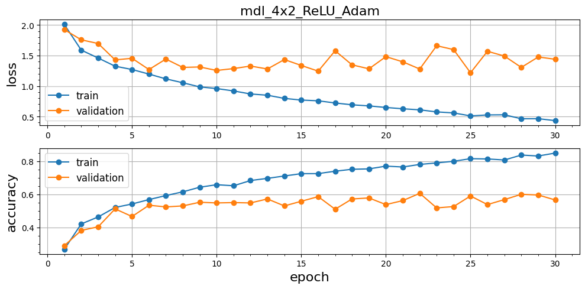
</p>

### Выводы по базовой модели

- После 10й эпохи обучения loss/accuracy на валидации не улучшаются; дальнейшее обучение может привести к переобучению модели.
- Архитектура обеспечивает точность на валидации **60.6%** (best mean accuracy).

## Часть 3: Поэтапная оптимизация модели
### 3.1. Оптимизация количества каналов

Сравниваются 2 архитектуры: `[2, 2, 2, 2]` и `[2, 2, 2]` с **256 каналами** на выходе в каждой.

#### Архитектура с меньшим количеством слоев: `[2, 2, 2]`
- `"layers_num": 3`
- `"block_size": 2`

| Layer / Operation                                  | Shape / Size      |
|----------------------------------------------------|-------------------|
| Input                                              | `(B, 3, 64, 64)`  |
| `Conv2d(3→64, kernel_size=7, stride=2, padding=3)` | `(B, 64, 32, 32)` |
| `BatchNorm2d(64)`                                  | `(B, 64, 32, 32)` |
| `activation`                                       | `(B, 64, 32, 32)` |
| `MaxPool2d(kernel_size=3, stride=1, padding=1)`    | `(B, 64, 32, 32)` |
| `Layer0`: 2× `BasicBlock` (64 channels, stride=2)  | `(B, 64, 16, 16)` |
| `Layer1`: 2× `BasicBlock` (128 channels, stride=2) | `(B, 128, 8, 8)`  |
| `Layer2`: 2× `BasicBlock` (256 channels, stride=2) | `(B, 256, 4, 4)`  |
| `AdaptiveAvgPool2d(output_size=(1, 1))`            | `(B, 256, 1, 1)`  |
| `Flatten()`                                        | `(B, 256)`        |
| `Linear(256→10)`                                   | `(B, 10)`         |
| Output                                             | `(B, 10)`         |

<p align="center" width="100%">
  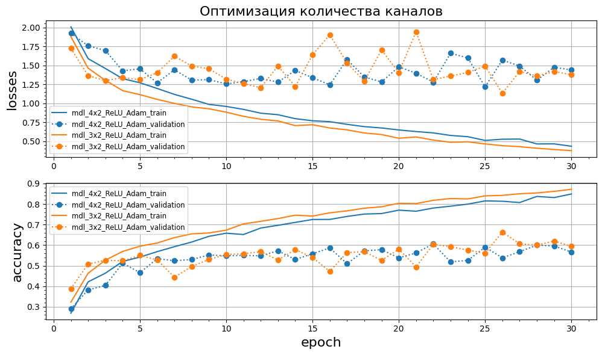
</p>

| Конфигурация | Параметры | Best Val Accuracy |
|--------------|-----------|-------------------|
| [2, 2, 2, 2] | 2.8M      | 60.6%             |
| [2, 2, 2]    | 2.8M      | 66.4%             |

Архитектура с меньшим количеством слоев быстрее обучается и достигает большую точность на валидации; эта конфигурация из 3х слоев взята в дальнейшую работу как лучшая.

### 3.2. Эксперименты с количеством residual блоков

Сравниваются 3 архитектуры: `[1, 1, 1]`, `[2, 2, 2]`, `[3, 3, 3]`.

#### Архитектура с уменьшенной глубиной слоев `[1, 1, 1]`
- `"layers_num": 3`
- `"block_size": 1`

| Layer / Operation                                  | Shape / Size      |
|----------------------------------------------------|-------------------|
| Input                                              | `(B, 3, 64, 64)`  |
| `Conv2d(3→64, kernel_size=7, stride=2, padding=3)` | `(B, 64, 32, 32)` |
| `BatchNorm2d(64)`                                  | `(B, 64, 32, 32)` |
| `activation`                                       | `(B, 64, 32, 32)` |
| `MaxPool2d(kernel_size=3, stride=1, padding=1)`    | `(B, 64, 32, 32)` |
| `Layer0`: 1× `BasicBlock` (64 channels, stride=2)  | `(B, 64, 16, 16)` |
| `Layer1`: 1× `BasicBlock` (128 channels, stride=2) | `(B, 128, 8, 8)`  |
| `Layer2`: 1× `BasicBlock` (256 channels, stride=2) | `(B, 256, 4, 4)`  |
| `AdaptiveAvgPool2d(output_size=(1, 1))`            | `(B, 256, 1, 1)`  |
| `Flatten()`                                        | `(B, 256)`        |
| `Linear(256→10)`                                   | `(B, 10)`         |
| Output                                             | `(B, 10)`         |

#### Архитектура с увеличенной глубиной слоев `[3, 3, 3]`
- `"layers_num": 3`
- `"block_size": 3`

| Layer / Operation                                  | Shape / Size      |
|----------------------------------------------------|-------------------|
| Input                                              | `(B, 3, 64, 64)`  |
| `Conv2d(3→64, kernel_size=7, stride=2, padding=3)` | `(B, 64, 32, 32)` |
| `BatchNorm2d(64)`                                  | `(B, 64, 32, 32)` |
| `activation`                                       | `(B, 64, 32, 32)` |
| `MaxPool2d(kernel_size=3, stride=1, padding=1)`    | `(B, 64, 32, 32)` |
| `Layer0`: 3× `BasicBlock` (64 channels, stride=2)  | `(B, 64, 16, 16)` |
| `Layer1`: 3× `BasicBlock` (128 channels, stride=2) | `(B, 128, 8, 8)`  |
| `Layer3`: 3× `BasicBlock` (256 channels, stride=2) | `(B, 256, 4, 4)`  |
| `AdaptiveAvgPool2d(output_size=(1, 1))`            | `(B, 256, 1, 1)`  |
| `Flatten()`                                        | `(B, 256)`        |
| `Linear(256→10)`                                   | `(B, 10)`         |
| Output                                             | `(B, 10)`         |

<p align="center" width="100%">
  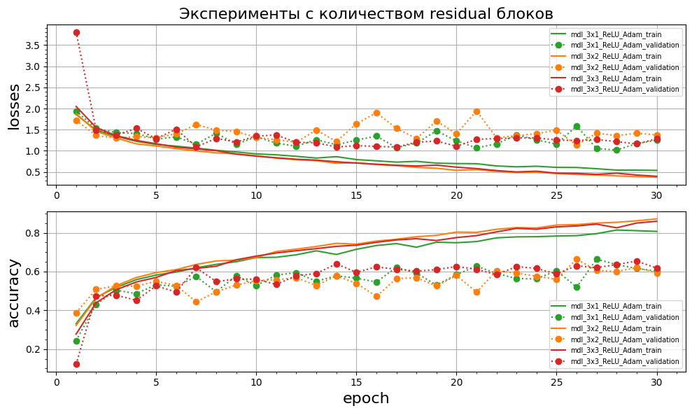
</p>

| Конфигурация | Параметры | Best Val Accuracy | Epoch (best) |
|--------------|-----------|-------------------|--------------|
| [1,1,1]      | 1.2M      | 66.4%             | 27           |
| [2,2,2]      | 2.8M      | 66.4%             | 26           |
| [3,3,3]      | 4.3M      | 65.4%             | 29           |

Все 3 рассмотренные конфигурации демонстрируют похожую динамику обучения и точность на валидации. Выбрана конфигурация `[2, 2, 2]`, т.к. быстрее других достигла лучшей точности.

### 3.3. Эксперименты с функциями активации

В [model_structure.py](src/models/model_structure.py) создана функция `def set_activation(activation: str) -> nn.Module:`.

<p align="center" width="100%">
  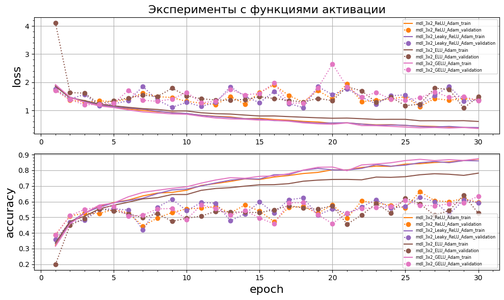
</p>

По скорости обучения и достигаемой точности на валидации практически нет отличий. Модель с функцией активации `ELU` демонстрирует заметно меньший темп на обучении, но это может быть связанно с неудачной инициализацией начальных весов.

## Часть 4: Финальная модель и тестирование
### 4.1. Создание финальной модели

Финальная модель построена на конфигурации `[2, 2, 2]` с функциями активации `ReLU`.

<p align="center" width="100%">
  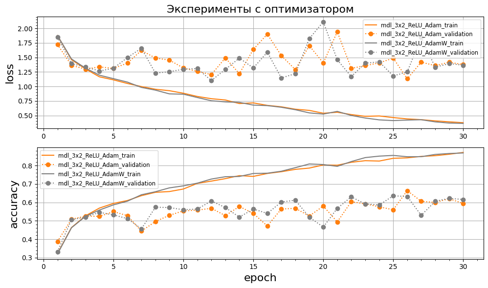
</p>

Оба решателя, `Adam` и `AdamW`, в среднем демонстрируют одинаковые результаты.

### 4.2. Тестирование на test set

| wordnet_id   | classname    | Precision   | Recall   | F1-score   | Support   |
|--------------|--------------|-------------|----------|------------|-----------|
| n01910747    | jellyfish    | 0.8837      | 0.7600   | 0.8172     | 50        |
| n02124075    | Egyptian cat | 1.0000      | 0.2600   | 0.4127     | 50        |
| n03854065    | pipe organ   | 0.7800      | 0.7800   | 0.7800     | 50        |
| n02403003    | ox           | 0.5814      | 0.5000   | 0.5376     | 50        |
| n09256479    | coral reef   | 0.6338      | 0.9000   | 0.7438     | 50        |
| n02415577    | bighorn      | 0.5161      | 0.6400   | 0.5714     | 50        |
| n02814533    | beach wagon  | 0.6136      | 0.5400   | 0.5745     | 50        |
| n04285008    | sport car    | 0.5970      | 0.8000   | 0.6838     | 50        |
| n03796401    | moving van   | 0.6964      | 0.7800   | 0.7358     | 50        |
| n04254777    | sock         | 0.6667      | 0.6800   | 0.6733     | 50        |

<p align="center" width="100%">
  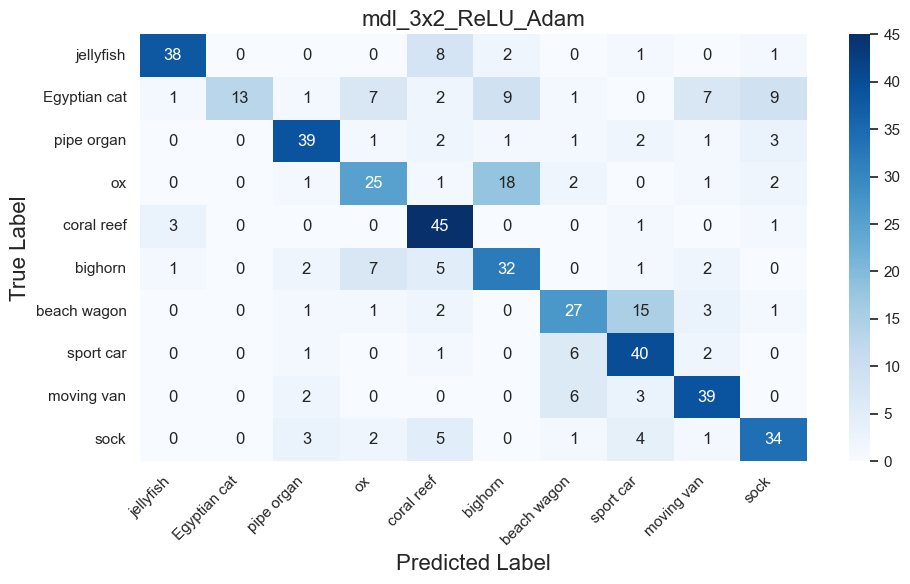
</p>

### 4.3. Визуальный анализ

Из тестового набора изображений выбраны 10 случайных примеров - по 1 из классов, на которых обучалась модель.

<p align="center" width="100%">
  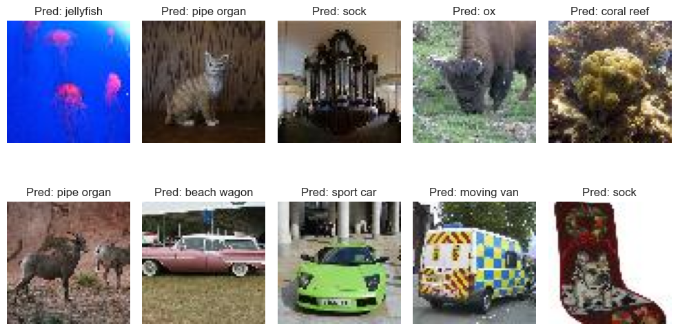
</p>

3 примера из 10 отнесены к неверному классу.

### 4.4. Сравнительная таблица всех экспериментов

| Этап          | Конфигурация        | Параметры | Best Val Accuracy | Final Train Accuracy |
|---------------|---------------------|-----------|-------------------|----------------------|
| **Baseline**  | [2, 2, 2, 2] ReLU   | 2.8M      | 60.6%             | 84.9%                |
| **3.1-A**     | [2, 2, 2, 2] ReLU   | 2.8M      | 60.6%             | 84.9%                |
| **3.1-B**     | [2, 2, 2] ReLU      | 2.8M      | 66.4%             | 87.2%                |
| **3.2-A**     | [1, 1, 1] ReLU      | 1.2M      | 66.4%             | 80.7%                |
| **3.2-B**     | [2, 2, 2] ReLU      | 2.8M      | 66.4%             | 87.2%                |
| **3.2-C**     | [3, 3, 3] ReLU      | 4.3M      | 65.4%             | 85.9%                |
| **3.3-A**     | [2, 2, 2] ReLU      | 2.8M      | 66.4%             | 87.2%                |
| **3.3-B**     | [2, 2, 2] LeakyReLU | 2.8M      | 62.8%             | 86.0%                |
| **3.3-C**     | [2, 2, 2] ELU       | 2.8M      | 64.2%             | 78.2%                |
| **3.3-D**     | [2, 2, 2] GELU      | 2.8M      | 63.4%             | 87.4%                |
| **Final**     | [2, 2, 2] ReLU      | 2.8M      | 66.4%             | 87.2%                |

# Выводы
- В сравнении архитектур `[2, 2, 2, 2]` и `[2, 2, 2]` конфигурация `[2, 2, 2]` продемонстрировала более высокую точность на валидации при меньшем количестве обучаемых параметров.
- Оптимальна глубина в 2 блока в каждом слое. Переобучение на более глубоких моделях примерно такое же, как и на baseline.
- Архитектуры с разными функциями активации практически не отличаются по скорости обучения и достигаемой точности на валидации.
- Оба решателя, `Adam` и `AdamW`, в среднем демонстрируют одинаковые результаты.
- В качестве лучшей принята конфигурация `[2, 2, 2] ReLU`.

## Reference
- [Полный текст задания](https://github.com/physicorym/designing_neural_network_architectures_2025_01/tree/main/seminar_02)

## Приложения

### Визуализация архитектур
#### Архитектура базовая (baseline): `[2, 2, 2, 2]`
- `"layers_num": 4`
- `"block_size": 2`

<p align="center" width="100%">
  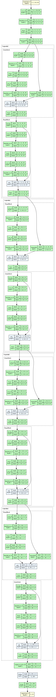
</p>

#### Архитектура с меньшим количеством слоев: `[2, 2, 2]`
- `"layers_num": 3`
- `"block_size": 2`

<p align="center" width="100%">
  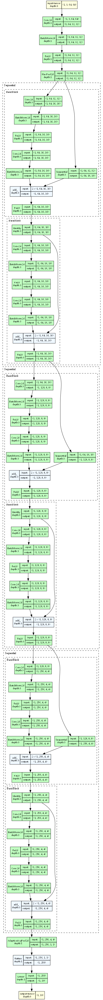
</p>

#### Архитектура с уменьшенной глубиной слоев `[1, 1, 1]`
- `"layers_num": 3`
- `"block_size": 1`

<p align="center" width="100%">
  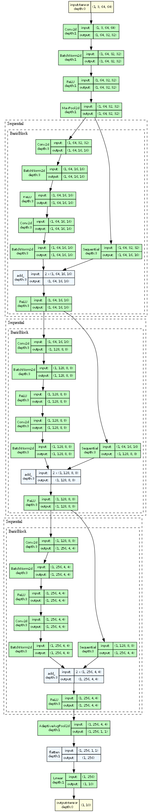
</p>

#### Архитектура с увеличенной глубиной слоев `[3, 3, 3]`
- `"layers_num": 3`
- `"block_size": 3`

<p align="center" width="100%">
  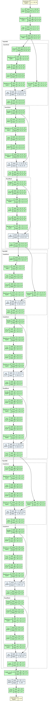
</p>

### Работа с проектом
#### 1. Скачайте файлы репозитория
#### 2. Скачайте датасет [tiny-imagenet-200](https://disk.yandex.ru/d/adWo9fVCLuVQ0Q)
#### 3. Создайте окружение в директории `.venv`
```
python -m venv .venv
```
#### 4. Активируйте окружение
```
.venv\Scripts\activate
```
#### 5. Установите библиотеки
```
pip install -r requirements.txt
```
В [main_notebook.ipynb](main_notebook.ipynb) скрипт визуализации архитектур на основе `draw_graph` требует установки [Graphviz](https://graphviz.org/download/).